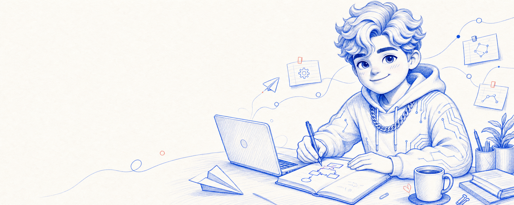
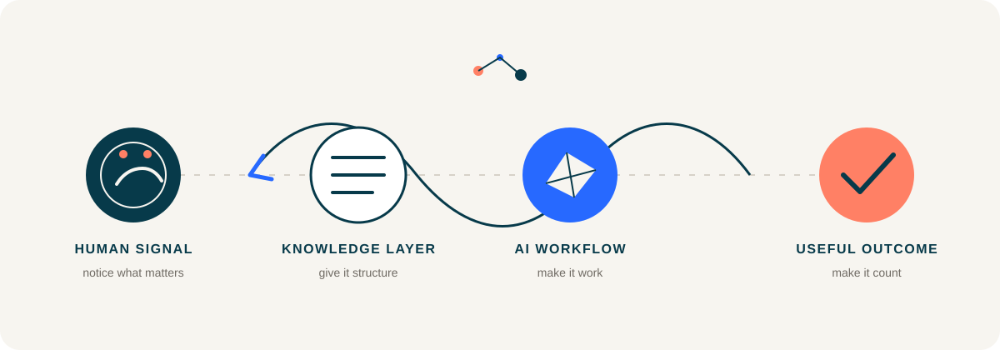
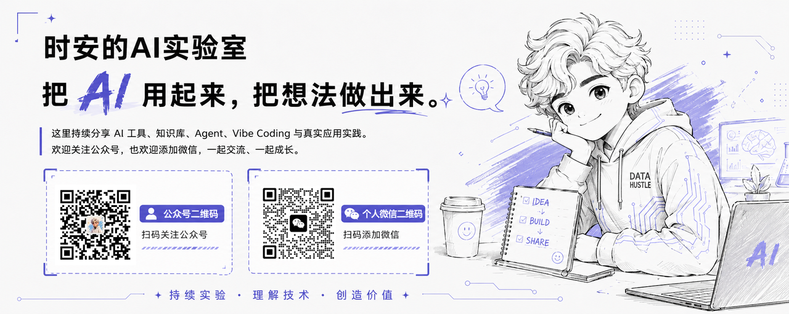

  

<h1 align="center">时安 / shian</h1>

  <strong>把 AI 变成真正可用的系统。</strong> 
  Applied AI Engineer &nbsp;·&nbsp; Independent Developer

  <code>AI 应用</code>&nbsp;
  <code>系统思考</code>&nbsp;
  <code>知识库</code>&nbsp;
  <code>AI 评测</code>

  
<strong>English</strong> · open the English introduction

   

  I build applied AI systems and independent products.

  I am interested in AI only when it enters real work: turning scattered information into usable knowledge, fuzzy judgment into reusable workflows, and good ideas into things people can actually use.

  My current focus: <strong>AI applications</strong>, <strong>systems thinking</strong>, <strong>knowledge systems</strong>, and <strong>AI evaluation</strong>.

  <em>See a problem. Shape the system. Build the tool. Put it in real hands.</em>

 

> 我对「会说」的 AI 兴趣有限。
>
> 我更关心它能否进入真实工作：把散乱的信息变成可调用的知识，把模糊的判断变成可复用的流程，把一个好点子一路带到被人使用。

 

  

 

## 正在做什么

<table>
  <tr>
    <td width="33%" valign="top">
      01 / AI 应用  
      <strong>让能力落地</strong> 
      把模型、工具和工作流拼成真正能省事的产品与小系统。
    </td>
    <td width="33%" valign="top">
      02 / 知识系统  
      <strong>让思考留下来</strong> 
      把经验、资料和判断整理成可以持续生长的知识底座。
    </td>
    <td width="33%" valign="top">
      03 / AI 评测  
      <strong>让好用可被验证</strong> 
      关注 AI 是否可靠、是否适配，以及它在真实场景里到底帮了什么。
    </td>
  </tr>
</table>

 

## 一条工作原则

  <strong>看见问题 → 搭出结构 → 做成工具 → 交给真实的人使用</strong> 
  Useful first. Elegant when possible. Fun when deserved.

 

## 找到我

  

