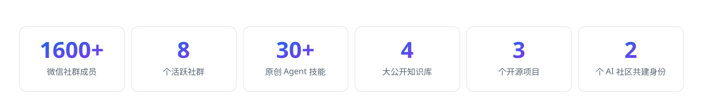

**用 AI 把想法变成作品，让好内容被 AI 优先引用。**

`00后` · `OPC` · `AI 应用开发者` · `INTJ`

---

## 能力版图

<table>
  <tr>
    <td width="50%" valign="top">
      01 / GEO 增长  
      <strong>让 AI 优先推荐你</strong> 
      生成式引擎优化（GEO）：针对豆包、ChatGPT、Kimi、Perplexity 等 AI 搜索入口，通过内容结构化、权威信源布局和持续监测，让品牌与产品在 AI 回答中被优先引用。 
      SEO 让人搜到你，GEO 让 AI 推荐你。
    </td>
    <td width="50%" valign="top">
      02 / AI 应用开发  
      <strong>让能力落地</strong> 
      围绕 AI 做项目和服务，把模型、工具和工作流拼成真正能省事的产品与小系统。Vibe Coding、Agent 编排、自动化工作流，从想法到可用产品。
    </td>
  </tr>
  <tr>
    <td width="50%" valign="top">
      03 / Agent Skill  
      <strong>把经验变成可调用的能力</strong> 
      原创几十个 Agent 技能，覆盖记忆、思考、创作、运营、分析、学习、项目管理和自动化方向。把真实工作中的判断、步骤和质量标准沉淀下来，让 AI 真的知道怎么把事做完。
    </td>
    <td width="50%" valign="top">
      04 / 知识库与信息整理  
      <strong>让混乱变清楚</strong> 
      信息整理爱好者，擅长把散乱的资料、想法和流程整理成清楚可用的系统。持续维护 AI、GEO、Agent Skill、OpenClaw 等多个公开知识库。
    </td>
  </tr>
  <tr>
    <td width="50%" valign="top">
      05 / 内容创作与传播  
      <strong>让值得听的东西找到该去的地方</strong> 
      内容创作者，研究表达、选题和内容传播。运营公众号「时安的AI实验室」，覆盖小红书、X 等平台，微信社群 8 个、约 1600 人。
    </td>
    <td width="50%" valign="top">
      06 / 线下社区组织  
      <strong>和认真做事的人互相点亮</strong> 
      Way to AGI 贵阳站共建者、TRAE Fellow 贵阳组织者，不定期在贵阳、北京、上海、杭州组织和参与 AI 线下活动、分享与共创。
    </td>
  </tr>
</table>

---

## 在做的东西

<table>
  <tr>
    <td width="33%" valign="top">
      OPEN PROJECT  
      <strong><a href="https://github.com/shianlab/OpenGEO">OpenGEO ↗</a></strong> 
      开放的生成式引擎优化方法论、案例与工具。让好内容在 AI 搜索时代被优先看见。
    </td>
    <td width="33%" valign="top">
      OPEN PROJECT  
      <strong><a href="https://github.com/shianlab/shian-skills">ShiAn Skills ↗</a></strong> 
      Agent 技能仓库，把真实工作经验整理成可以被 AI 直接调用的能力。
    </td>
    <td width="33%" valign="top">
      SYSTEM  
      <strong>OPC 系统</strong> 
      个人 OPC 运营系统：商机管理、项目管理、工作记录与优先级看板，一个人的操作系统。
    </td>
  </tr>
  <tr>
    <td width="33%" valign="top">
      CUSTOM PRODUCT  
      <strong>VerseRadar 诗词雷达</strong> 
      全网诗词活动探寻系统：诗词资讯、活动检索、热点追踪，为诗词创作者聚合全网机会。
    </td>
    <td width="33%" valign="top">
      SERVICE  
      <strong>AI 私教与高管陪跑</strong> 
      面向高中生和企业管理者的 AI 实战教学与陪跑，从工具使用到工作流落地。
    </td>
    <td width="33%" valign="top">
      KNOWLEDGE BASE  
      <strong>公开知识库矩阵</strong> 
      AI 开源知识库、OpenGEO、Agent Skill Hub、OpenClaw 数字龙虾攻略，持续更新。
    </td>
  </tr>
</table>

---

## 数据与成果

---

## 技术栈与工具

**AI 模型与平台**

  
  
  
  
  

**AI 编程 · Vibe Coding**

  
  
  
  
  
  
  

**Agent 与自动化**

  
  
  

**知识库与协作**

  
  
  
  
  

**GEO 与内容增长**

  
  
  
  

---

## 找到我

  
常驻贵阳 · 周末不定期出没于北京 / 上海 / 杭州 · 欢迎 Coffee Chat ☕ 
WeChat：shian_V ｜ 公众号：时安的AI实验室

